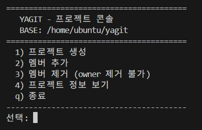
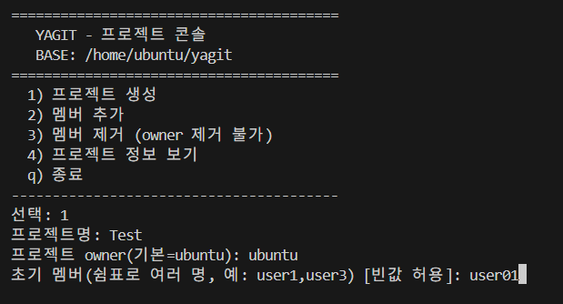
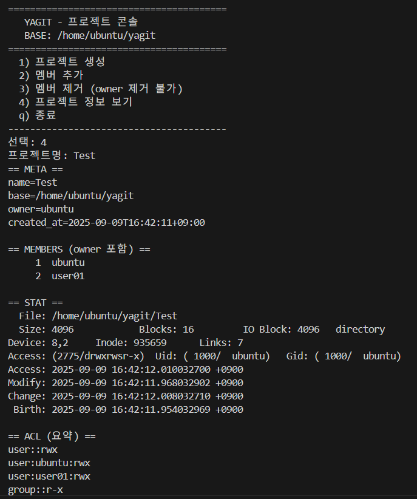
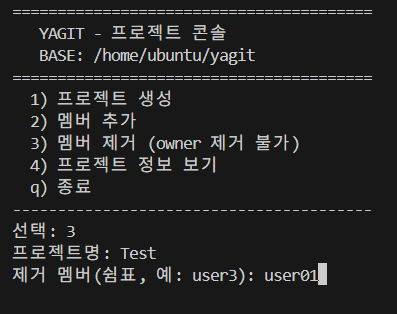
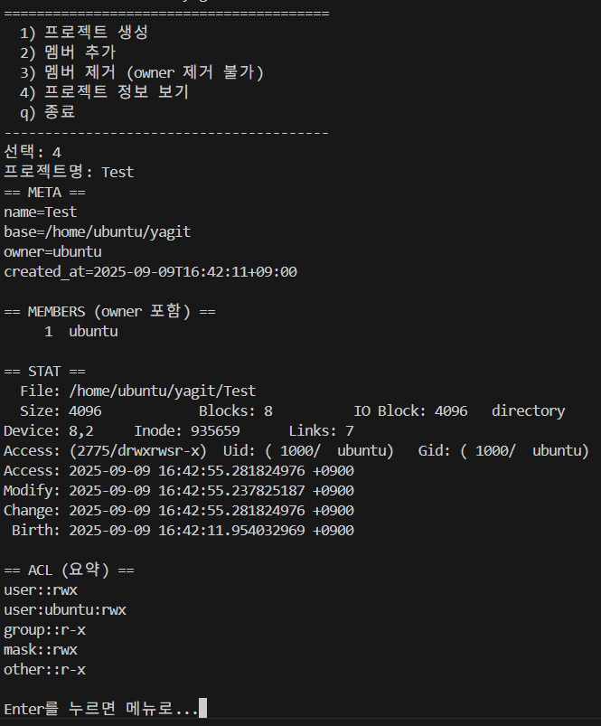

# \[Linux Server] YAGIT 프로젝트 콘솔

> Ubuntu 환경에서 `bash`와 `ACL(setfacl/getfacl)`을 활용하여
> 프로젝트 단위 **디렉토리/멤버/권한 관리**를 제공하는 미니 콘솔 시스템을 구축했습니다.
> root 없이도 *“멤버는 rwx, 비멤버는 r-x”* 권한 정책을 흉내낼 수 있어 협업 환경 시뮬레이션에 적합합니다.

---

## 주요 특징

* 프로젝트 생성 시 **owner 자동 멤버 포함**
* 멤버 관리: **추가 / 제거 / 정보 보기**
* 권한 정책:

  * 멤버 = `rwx` (읽기/쓰기/실행 가능)
  * 비멤버 = `r-x` (읽기/실행만 가능)
* **ACL 상속 적용** → 새로 만든 파일에도 동일한 정책 자동 적용
* 콘솔 UI 메뉴 기반으로 직관적 조작 가능

---

## 팀원 소개

| 팀원                                 | 프로필                                                                            | 회고                                                                                     |
| ---------------------------------- | ------------------------------------------------------------------------------ | -------------------------------------------------------------------------------------- |
| [임유진](https://github.com/imewuzin) |  | ACL로 협업 권한을 직접 설계하며 Linux 권한 체계를 깊이 이해했습니다. 단순한 bash 스크립트도 실제 운영 툴처럼 발전할 수 있음을 체감했습니다. |
| [이용훈](https://github.com/dldydgns) |   | 멤버 rwx/비멤버 r-x 정책을 구현하면서 보안과 협업의 균형을 배웠습니다. 실무 권한 정책 설계에도 응용할 수 있다는 자신감을 얻었습니다.        |

---

## 시스템 구성

* **OS:** Ubuntu 24.04.2 (VirtualBox VM)
* **패키지:** `acl`, `bash`
* **개발환경:** VS Code

---

## 설치 및 설정 절차

### ① 필수 패키지 설치

```bash
sudo apt update
sudo apt install -y acl
```

### ② 스크립트 작성

* 파일명: `yagit_menu.sh`
* 실행 권한: `chmod +x yagit_menu.sh`

```bash
#!/usr/bin/env bash
# YAGIT - 프로젝트 콘솔 요약

# 주요 함수
init_project()   # 프로젝트 생성 (owner 자동 포함, 초기 멤버 기록)
add_members()    # 멤버 추가 후 ACL 갱신
remove_members() # 멤버 제거 (owner 제거 불가)
show_info()      # META, 멤버 목록, ACL 요약 출력
apply_acl()      # 멤버=rwx, 비멤버=r-x 권한 적용 (상속 포함)

# 메인 메뉴 루프
main_menu() {
  echo "1) 프로젝트 생성"
  echo "2) 멤버 추가"
  echo "3) 멤버 제거"
  echo "4) 프로젝트 정보 보기"
  echo "q) 종료"
}
```

* **핵심 로직**

  * `.yagit_meta` → 프로젝트명, owner, 생성시간 기록
  * `.yagit_members` → owner 및 멤버 목록 기록
  * `setfacl` → 멤버는 `rwx`, others는 `r-x`, 상속 ACL 적용
  * 콘솔 메뉴에서 선택 시 해당 함수 실행

---


## 기능 설명

### 1️⃣ 메뉴 화면


- 원하는 기능의 번호 입력

---

### 2️⃣ 프로젝트 생성



* 결과

---

### 3️⃣ 멤버 제거



* `.yagit_members`에서 user01 제거
* ACL에서 user01 항목 삭제 → 더 이상 쓰기 불가 (읽기만 가능)
* 결과


---

### 4️⃣ 멤버 추가

- 멤버 제거와 동일한 방식으로 진행

* ACL 자동 갱신 → 새 멤버도 `rwx` 권한 부여
